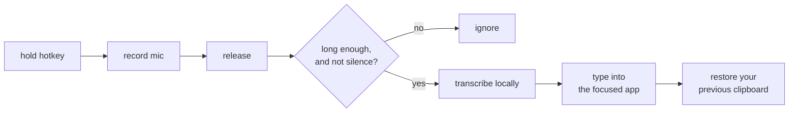
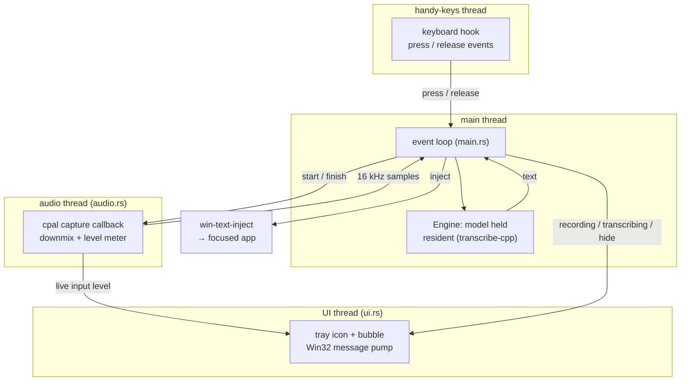
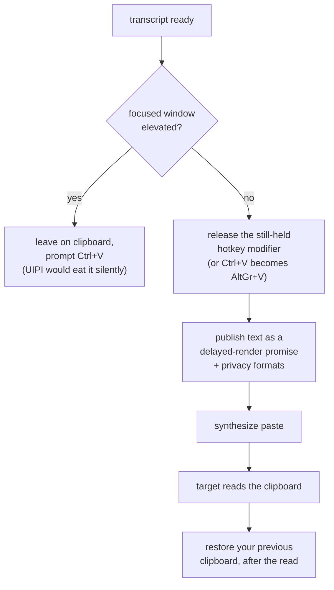

# dictate

Personal push-to-talk dictation for Windows. Hold a key, speak, release — the text appears wherever you were typing.

No window, no browser engine, no settings screen. Configuration is one TOML file; feedback is a tray icon and a small bubble that reacts to your voice. That is the whole reason it is around a thousand lines rather than tens of thousands.

Built for myself. Published because it might be a useful starting point for someone else.

## What it does

```
hold hotkey  →  record mic  →  release  →  transcribe locally  →  type into the focused app
```



- **Fully local.** Speech recognition runs on your machine. Nothing is uploaded.
- **Reacts to your voice.** The bubble's bars follow your actual microphone level, so silence is flat and speech moves them.
- **Stays out of the way.** The bubble never takes focus, so the caret stays in the app you are dictating into.
- **Correct clipboard handling.** Text delivery goes through [`win-text-inject`](https://crates.io/crates/win-text-inject), which restores your previous clipboard only after the target has read the new text, and keeps transcripts out of Windows clipboard history.

## Architecture

Five files, each one job.

```
main.rs       the loop, and the resident model
audio.rs      microphone capture, downmix, level metering, resample to 16 kHz
config.rs     dictate.toml
autostart.rs  the HKCU Run key
ui.rs         tray icon and the voice-reactive bubble
```

Three threads, so the parts that must not block each other never do: the keyboard hook, the audio callback, and the UI message pump each run on their own, and the main loop coordinates them.



Almost everything is thin glue over a crate. `ui.rs` is the largest file because the tray icon and the bubble are raw Win32 GDI, which nothing does for you, and because the bubble has one hard requirement — it must never steal focus, or the text lands nowhere.

| Job | Crate | Notes |
|---|---|---|
| Global hold-to-talk hotkey (incl. modifier-only bindings) | [`handy-keys`](https://crates.io/crates/handy-keys) | reports press *and* release, which `RegisterHotKey` cannot |
| Microphone capture | [`cpal`](https://crates.io/crates/cpal) | its callback also feeds the bubble's level meter |
| Resampling to 16 kHz | [`rubato`](https://crates.io/crates/rubato) | anti-aliased, not naive decimation |
| Speech recognition | [`transcribe-cpp`](https://crates.io/crates/transcribe-cpp) | ggml; loads the same GGUF models Handy uses |
| Text delivery | [`win-text-inject`](https://crates.io/crates/win-text-inject) | built for exactly this; see below |

### Why the text-delivery step is its own crate

Pasting a transcript into whatever app has focus is the step every dictation tool gets subtly wrong, so it lives in a separate, tested crate. Everything it fixes is something this app hits *by construction*:



- The hotkey modifier is **held by construction** when this app pastes — it is a push-to-talk key you are still pressing. Sanitizing it is not an edge case here, it is every single press.
- Because delivery is a paste, your clipboard would be **destroyed on every dictation** without the delayed-render restore. That is [Handy issue #502](https://github.com/cjpais/Handy/issues/502), and the fix is the whole reason this app does not have it.
- Every sentence you speak passes through the clipboard, so without the four privacy opt-out formats it would land in **Windows clipboard history and cloud sync** — quietly breaking the "fully local" promise.

## Building

Needs the Rust MSVC toolchain, and — because `transcribe-cpp` compiles a ggml backend — CMake, the MSVC C++ build tools, and the Vulkan SDK (for the GPU backend; CPU-only builds do not need it).

```
cargo build --release
```

The ggml backend DLLs must sit next to `dictate.exe`. They are produced by the `transcribe-cpp` build; copy them into the same directory as the binary.

## Configuration

On first run `dictate` writes a commented `dictate.toml` next to the executable and stops so you can fill it in.

```toml
# Hold this to record. Modifier-only bindings work and are usually the most
# comfortable, because they cannot collide with an application shortcut.
#   "CtrlRight"   "AltRight"   "Ctrl+Space"   "F13"
hotkey = "CtrlRight"

# Absolute path to a GGUF speech model. Any model transcribe-cpp supports works;
# Parakeet and Canary are good CPU choices. Handy's models live under
# ~/.cache/huggingface/hub if you already have it installed.
model = "C:/path/to/model.gguf"

# Language hint. Comment out to let the model detect, which is less accurate on
# short utterances.
language = "en"

# Ignore recordings shorter than this, so an accidental tap does not produce a
# hallucinated transcript.
min_recording_ms = 400

# Keep the model resident between dictations. Costs idle RAM, saves seconds per
# dictation, since loading dominates everything else.
keep_model_loaded = true

# Start with Windows. Toggling this and restarting is enough in either direction.
autostart = false
```

The tray icon's right-click menu opens this file and exits the app.

## Deliberately not here

This is a personal tool, and the absences are the point.

- No model manager or download UI — put a `.gguf` path in the config.
- No settings window — it is a text file.
- No cross-platform support — Windows only.
- No auto-update, no telemetry, no account.

## Status

Works, and used daily by its author. Rough edges remain: the bubble's shape and animation are tuned by hand-editing constants, there is no voice-activity trimming, and the paste-chord table is small. Contributions and forks welcome, but it is shaped for one person's use first.

## License

MIT OR Apache-2.0.
